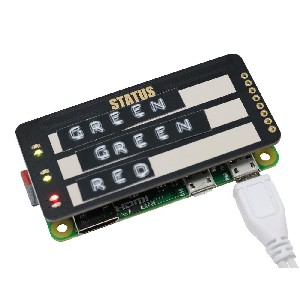
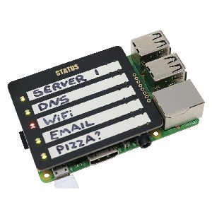

# GPIO Zero tutorial and examples for the STATUS Board and STATUS Zero

[STATUS Zero](https://thepihut.com/collections/status-boards/products/status-board-zero)
comprises three strips, each containing a pair of LEDS (red and green).



[STATUS Board](https://thepihut.com/collections/status-boards/products/status-board-pro)
comprises five strips, each containing a button and a pair of LEDS (red and
green).



## Install the software

To use the STATUS boards, you'll need the latest version of GPIO Zero (v1.4 or
above). Simply update your package list and install or upgrade GPIO Zero with:

```bash
sudo apt update
sudo apt install python3-gpiozero python-gpiozero -y
```

## Tutorials

- [STATUS Zero](tutorials/status-zero/README.md)
- [STATUS Board](tutorials/status-board/README.md)

## Examples

- [Button demo](examples/button-demo/README.md)
- [Who's in?](examples/whos-in/README.md)
- [London Tube line status](examples/tube/README.md)
- [Rain in cities](examples/rain/README.md)
- [Websites up or down](examples/website-monitor/README.md)
- [Travis build status](examples/travis-build/README.md)
- [In the news](examples/news/README.md)
- [Multi-room motion sensor](examples/multi-room-motion/README.md)
- [Speedtest monitor](examples/speedtest/README.md)

## API documentation

- [Status Zero](http://gpiozero.readthedocs.io/en/stable/api_boards.html#statuszero)
- [Status Board](http://gpiozero.readthedocs.io/en/stable/api_boards.html#statusboard)
